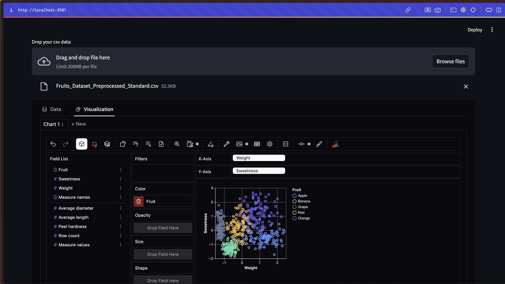

# Exotic-Fruit-Classification

## Table of Contents
1. [Introduction](#introduction)
2. [Dataset](#dataset)
3. [Preprocessing and EDA](#preprocessing-and-eda)
4. [Machine Learning with KNN](#machine-learning-with-knn)
5. [Results](#results)
6. [Extra: Visualization with Pygwalker](#extra-visualization-with-pygwalker)
7. [Requirements](#requirements)


## Introduction

This repository is the first project of the master's degree in AI Engineering with [Profession AI](https://profession.ai), all the credits for the requests and idea go to this team.

TropicTaste Inc., a leading exotic fruit distributor, is looking to improve the efficiency and accuracy of the fruit classification process. The **goal** is to develop a machine learning model that can predict the type of fruit based on numerical features. The current exotic fruit classification process is manual and error-prone, making it inefficient and resource-intensive. The need for an automated and accurate system is crucial to streamline business operations and maintain high quality standards.

By implementing an automated classification model, TropicTaste Inc. will be able to:
- Improve Operational Efficiency: Automating classification will reduce the time and resources needed, increasing productivity.
- Reduce Human Error: A machine learning model will minimize classification errors, ensuring greater accuracy.
- Optimize Inventory: Accurate classification will allow for better inventory management, ensuring optimal storage conditions for each type of fruit.
- Increase Customer Satisfaction: Correct identification and classification of fruits will help maintain high quality standards, improving customer satisfaction.

Project Requirements:
1. Loading and preprocessing of exotic fruit data.
2. Handling of any missing values, normalization and scaling of data.
3. Development and training of the KNN model.
4. Optimization of parameters to improve predictive accuracy.
5. Use of cross-validation techniques to evaluate the generalization ability of the model.
6. Calculation of performance metrics, such as classification accuracy and error.
7. Create graphs to visualize and compare the model performance.
8. Analyze and interpret the results to identify areas for improvement.

To complete all the project requirements, I have created a single [notebook](Project_Notebook.ipynb) where all operations are performed and results are visualized. Additionally, I have organized the code into a [`src`](src/) folder containing Python files with the methods used in the notebook.


## Dataset

This dataset contains the following variables:
- **Fruit**: The type of fruit. This is the target variable that we want to predict.
- **Weight** (g): The weight of the fruit in grams. Continuous variable.
- **Average diameter** (mm): The average diameter of the fruit in millimeters. Continuous variable.
- **Average length** (mm): The average length of the fruit in millimeters. Continuous variable.
- **Peel hardness** (1-10): The hardness of the fruit's peel on a scale of 1 to 10. Continuous variable.
- **Sweetness** (1-10): The sweetness of the fruit on a scale of 1 to 10. Continuous variable.
- **Acidity** (1-10): The acidity of the fruit on a scale of 1 to 10. Continuous variable.

In folder [`Data`](Data/), you can find both the original dataset and the transformed dataset after preprocessing steps.


## Preprocessing and EDA

In the [`data_engineering.py`](src/preprocessing_and_viz.py) file, I have gathered all methods for managing dataset preparation and Exploratory Data Analysis (EDA), including:

- **Analysis of Statistical Information**: An initial analysis of the dataset's statistics revealed that the feature *Peel hardness* does not have a maximum value of 10, as suggested by the project guidelines, but instead, it reaches a value of 13.72.

- **Preprocessing with Duplicate and Missing Values Check**: I searched for any duplicates and missing values in the dataset, but none were found. The dataset remains with a shape of (500, 6).

- **Data Visualization Before Feature Engineering**: Interactive plots were generated using the `Plotly` package to visualize the data. These visualizations provided crucial insights into the relationships between features. It is highly recommended to explore these plots directly in the notebook to gain an interactive, step-by-step understanding, as each plot is accompanied by descriptive markdown comments.

- **Implementation of Feature Scaling Solutions**: Two feature scaling methods were implemented to transform the continuous features:
  1. **MinMaxScaler**: This method scales the features into a fixed range, which can lead to a loss of significant information.
  2. **StandardScaler**: This method standardizes features by removing the mean and scaling to unit variance. This was chosen as the final approach due to its statistical robustness, especially for distributions that, with an increasing number of data points, are expected to approach a normal distribution.

- **Second Visualization with Transformed Data**: To validate the chosen preprocessing steps, I visualized the transformed dataset using several types of Plotly plots: Distplot with Normal Distribution, Distribution with Histogram and Box Plot, Scatter Plots with Target Column Comparison.

These steps provide a comprehensive understanding of the dataset and ensure that the data is well-prepared for the subsequent machine learning modeling phase.


## Machine Learning with KNN

In the [`models.py`](src/models.py) file, I have implemented methods for training, optimizing and evaluating the K-Nearest Neighbors (KNN) algorithm:

- **Evaluate KNN Algorithms Using a Train-Test Split and GridSearchCV Optimization**:
  1. **Stratified Dataset Splitting**: The dataset was split into training and testing sets in a stratified manner to ensure that each class is represented proportionally in both subsets.
  2. **Optimization with GridSearchCV**: A GridSearchCV procedure was applied to find the optimal number of neighbors (`n_neighbors`) for the KNN model. The optimization was based on maximizing the accuracy score on the validation set, resulting in the selection of the best-performing KNN model.

- **Evaluate KNN Algorithms Using a Stratified K-Folds Cross-Validation for Each Number of Neighbors in [1, 20]**:
  1. **Alternative Optimization Approach**: This method serves as an alternative to the GridSearchCV approach. It helps determine the best number of neighbors for the KNN model by evaluating the model performance for each value of `n_neighbors` from 1 to 20.
  2. **Advantages of Manual Cross-Validation**: This implementation allows for the direct observation of both training and test metrics, including accuracy and log loss. Moreover, manually controlling the cross-validation process enables more granular tuning of parameters and increases the robustness of the resulting model.

- **Evaluate the Best KNN Model with Number of Neighbors 6 Using Stratified K-Folds Cross-Validation**:
  1. **Stratified 10-Fold Cross-Validation**: To further enhance the model's robustness and statistical reliability, a stratified K-Folds cross-validation with 10 folds was conducted using the KNN model with 6 neighbors, which was identified as the optimal configuration. This procedure saves the results for multiple metrics, including accuracy, precision, recall, F1 score, and log loss.

These methods provide a thorough evaluation and optimization framework for the KNN model, ensuring it performs reliably across different validation strategies. For detailed results and analysis, please refer to the next section.


## Results

The detailed description of the results, including both the Exploratory Data Analysis (EDA) and model performance evaluations, can be found in the markdown cells of the [notebook](Project_Notebook.ipynb). It is highly recommended to view the results directly within the notebook, as interactive `Plotly` graphs and plots with `Matplotlib` and `Seaborn` have been utilized for a more dynamic and static exploration of the data.

### Key Findings

1. **Optimization of KNN using Train-Test Split and GridSearchCV**:
   - The best-performing model was found with `n_neighbors = 6`, achieving an accuracy score of **0.925** on the test set. This indicates a good balance between model complexity and performance.
   - The Error Bar Plot confirmed that `n_neighbors = 6` not only has the highest mean accuracy score for the test set but also one of the highest for the training set, avoiding potential overfitting.
   - The Classification Report and Confusion Matrix highlighted that while most labels like Apple, Grape, and Banana achieved high scores in accuracy, precision, and recall, the model showed lower performance for the Orange label. This suggests that either model adjustments or more sophisticated models (e.g., SVM, Random Forest) could be explored to enhance the performance further.

2. **Evaluation with Stratified K-Folds Cross-Validation for Different Neighbors**:
   - Accuracy and log loss plots showed that while `n_neighbors = 6` optimizes the accuracy for both training and test sets, `n_neighbors = 7` could offer a slight improvement in minimizing the log loss. This insight could be helpful for fine-tuning the model based on different evaluation criteria.

3. **Robustness Assessment of the Best KNN Model with Stratified K-Folds Cross-Validation**:
   - The cross-validation results showed that while the metric scores for the training set were more stable, the test set scores presented more variability. Nonetheless, the mean values for training and test sets remained comparable across all metrics (e.g., accuracy of **95%** for training and **94%** for testing), indicating a robust model.
   - Violin plots confirmed that the distribution of results is generally normal for each metric and test set. The lower variance range for the training set further emphasizes the model's stability, while the test set demonstrates slightly more variability, which is expected in a real-world scenario.


## Extra: Visualization with Pygwalker

Leveraging `Pygwalker` for data visualization is a powerful idea and an excellent opportunity to enrich data analysis. Pygwalker is an innovative tool that allows for creating interactive visualizations directly from a pandas DataFrame, transforming it into a user-friendly interface similar to Tableau or Power BI. This approach not only enhances the exploratory data analysis (EDA) process but also facilitates a deeper understanding of the data and the results obtained from machine learning models. This ability is a great asset for showcasing the project's workflow and findings in a compelling manner. 

### Implementation Details

For this project, I implemented **Pygwalker** using **Streamlit**, a popular Python library for building web applications. The app allows users to interactively explore:

- **The Original Dataset**: Provides insights into the raw data, helping to identify potential patterns, outliers, and correlations.
- **The Transformed Dataset**: Enables a better understanding of the preprocessing effects, such as feature scaling and normalization, on the data distribution and its impact on different features.
- **Results from the Best KNN Model's Cross-Validation**: Visualizing the model's performance metrics (such as accuracy, precision, recall, etc.) helps in presenting the robustness and reliability of the model in a clear and interactive way.

### Replicability

The entire setup is easily replicable using the provided `app_viz.py` [file](app_viz.py), which contains the Streamlit application code. With a single command (`streamlit run app_viz.py`), you can run the app locally, explore the data interactively, and use these visualizations to enhance your project presentations.




## Requirements

To run this project, I used a 3.11.x Python version. You need to installed the packages in the [requirements](requirements.txt):

```bash
pip install -r requirements.txt
